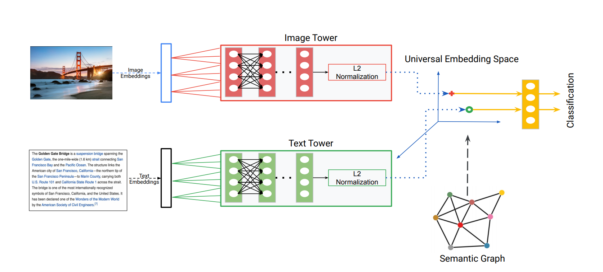
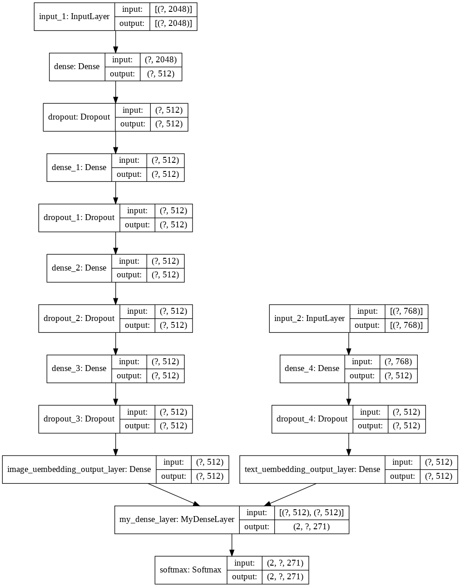

<h1 align="center">
  <br>
HUSE: Hierarchical Universal Semantic Embedding
  <br>
</h1>

> **Hierarchical Universal Semantic Embeddings**<br>
> Pradyumna Narayana, Aniket Pednekar , Abishek Krishnamoorthy , Kazoo Sone , Sugato Basu <br>
>
> **Abstract:** *There is a recent surge of interest in cross-modal representation learning corresponding to images and text. The main challenge lies in mapping images and text to a shared latent space where the embeddings corresponding to a similar semantic concept lie closer to each other than the embeddings corresponding to different semantic concepts, irrespective of the modality. Ranking losses are commonly used to create such shared latent space — however, they do not impose any constraints on inter-class relationships resulting in neighboring clusters to be completely unrelated. The works in the domain of visual semantic embeddings address this problem by first constructing a semantic embedding space based on some external knowledge and projecting image embeddings onto this fixed semantic embedding space. These works are confined only to image domain and constraining the embeddings to a fixed space adds additional burden on learning. This paper proposes a novel method, HUSE, to learn crossmodal representation with semantic information. HUSE learns a shared latent space where the distance between any two universal embeddings is similar to the distance between their corresponding class embeddings in the semantic embedding space. HUSE also uses a classification objective with a shared classification layer to make sure that the image and text embeddings are in the same shared latent space. Experiments on UPMC Food-101 show our method outperforms previous state-of-the-art on retrieval, hierarchical precision and classification results.*

<h4 align="center"><a href="https://arxiv.org/abs/1911.05978">2004.04467</a></h4>


## Training your model
### Dataset: 
- Images: Put the unzipped images in the /images folder
- Create a data.csv file with 'img_name,text,class' columns. (See the example provided)
### Config
- The config.ini file can be modified to update training parameters such as learning_rate, graph_threshold, dataset_path, etc
- To specify batch_size and number of epochs, specify them in the command line when calling `train.py` as follow
``` python trian.py -b 512 -e 1500```
### Environment Setu
- Works on
```
tensorflow               2.2
sentencepiece            0.1.86 
```
### train.py vs large_ram_train.py 
- Running train.py will encode a `batch_size` number of entries each epoch and discard the encodings when the epoch is finished. This allows training on extremely huge datasets because the entire dataset is not loaded onto memory at once
- Running large_ram_train.py will encode the entire dataset and store it on memory. This can speed up the training and reduce redundancy. Use this if memory is not a constraint.  
## Saved Model
- The model will be saved post training. 
- Checkpoints feature will be added soon

## Model Description


(Source: <a href="https://arxiv.org/abs/1911.05978">2004.04467</a>)

The model encorporates an architecture that leverages the semantic similarity between classes, and combines them to get image and text embeddings in a universal space. A pre-trained model is used to get image embeddings that is fed into an image tower consisting of fully connected dense layers. 
A pre-trained model is used to get text embeddings that are passed through a text tower also consisting of fully connected Dense layers. The output of these two towers are then passed through a **single dense shared hidden layer**.
There are **three losses** that are used to train the model.
- Softmax cross entropy loss when calculating Class level similarity
- Graph regularization loss to calculate semantic similarity
- Cross Modal Gap loss  

The architecture in looks like this:


### To-do:  
- [x] Add Bert model capable of running on GPU
- [x] Use argparse for arguments, add better arguments
- [ ] Add example data and images
- [x] Save model weights half-way
- [ ] Support for text that is longer than 512 words using TF-IDF
- [x] Fix batching issue - 1 EPOCH uses only one batch + Encode and store to ram

### Credits and acknowledgements:
For constant support and guidance, [Harsha Bommana](https://www.linkedin.com/in/harshabommana)   
For helping in understanding how to tokenize inputs for BERT: https://medium.com/@vineet.mundhra/loading-bert-with-tensorflow-hub-7f5a1c722565   
The hundreds of articles and blogs that explained various concepts for free    

## Citation
>

    @misc{narayana2019huse,
    title={HUSE: Hierarchical Universal Semantic Embeddings},
    author={Pradyumna Narayana and Aniket Pednekar and Abishek Krishnamoorthy and Kazoo Sone and Sugato           Basu},
    year={2019},
    eprint={1911.05978},
    archivePrefix={arXiv},
    primaryClass={cs.CV}
     }
